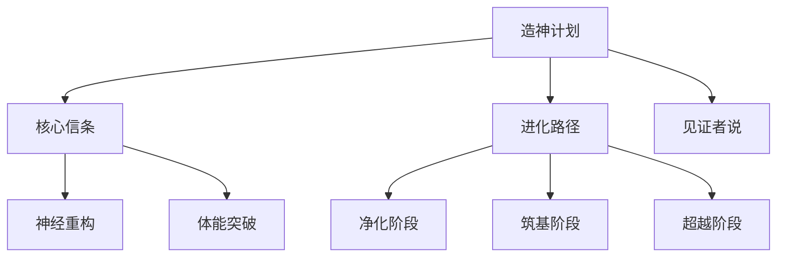

# 造神计划 (Ascension Project)


## 🌟 项目概述

**凡人之躯，亦可比肩神明** —— 造神计划是一个通过系统化训练帮助个人实现全方位进化的开源项目。融合神经科学、古典哲学与现代科技，打造90天蜕变计划。

## ✨ 核心特性

- 🧠 **神经重塑** - 戒除多巴胺依赖，重建奖励机制
- 💪 **体能突破** - 5×5力量训练与HIIT结合
- 📚 **知识架构** - 构建T型知识体系
- 💰 **财富自由** - 实践FIRE运动理念
- 🧘 **精神觉醒** - 斯多葛哲学实践

## 🛠️ 技术栈




## 🚀 快速开始

1. **克隆仓库**
   ```bash
   git clone https://github.com/DearLicy/ascension-project.git
   ```

2. **本地运行**
   ```bash
   cd ascension-project
   # 使用Live Server等工具打开index.html
   ```

3. **部署到GitHub Pages**
   - 在仓库设置中启用GitHub Pages
   - 选择`main`分支和`/root`目录

## 📂 项目结构

```
ascension-project/
├── index.html          # 主页面
├── about.html          # 关于页面
├── style.css           # 主样式表
└── README.md           # 项目说明
```

## 🌐 在线体验

访问部署版本: [https://dearlicy.github.io/Ascension-Project](https://dearlicy.github.io/Ascension-Project)

## 🧪 开发指南

1. **分支策略**
   - `main`: 生产环境代码
   - `dev`: 开发分支
   - `feature/*`: 功能开发分支

2. **提交规范**
   ```bash
   git commit -m "feat: 添加进化路径模块"
   git commit -m "fix: 修复导航栏flex布局"
   ```

## 🤝 如何贡献

1. Fork项目
2. 创建新分支 (`git checkout -b feature/amazing-feature`)
3. 提交更改 (`git commit -m 'Add some amazing feature'`)
4. 推送到分支 (`git push origin feature/amazing-feature`)
5. 提交Pull Request

## 📜 开源协议

[MIT License](LICENSE)

## 📧 联系我们

如有任何问题，请联系: [Email](mailto:82719519@qq.com)

---

<div align="center">
  <sub>造神计划 | 让每个人都成为更好的自己</sub>
</div>
